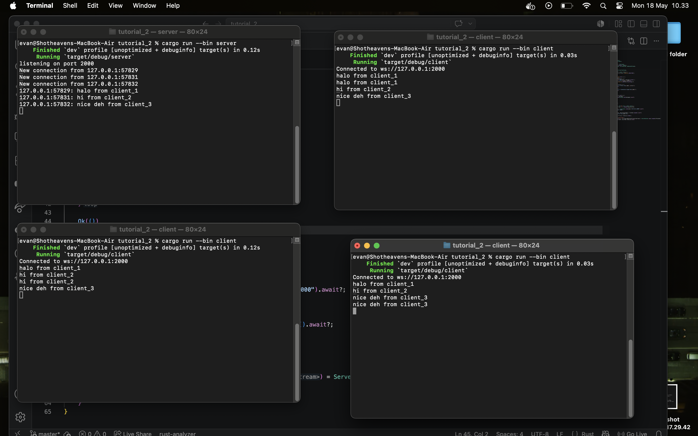
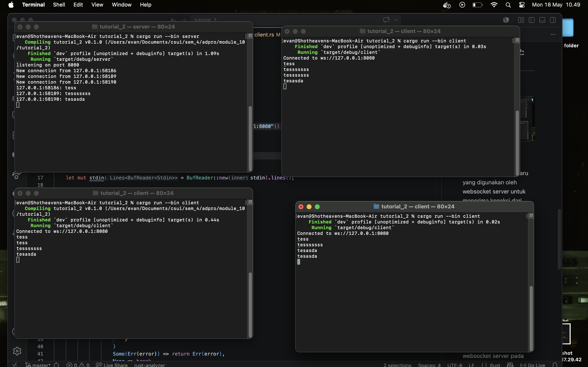

# Tutorial 2 (Broadcast Chat)

## Experiment 2.1: Original Code and How It Runs

### Cara Menjalankan Program

Server dijalankan melalui command berikut,

```bash
cargo run --bin server
```

Client dijalankan melalui command berikut,

```bash
cargo run --bin client
```

Pada eksperimen ini, program menjalankan satu server dan tiga client pada terminal yang berbeda.

### Screenshot-1



### Penjelasan

server dijalankan pada URI `ws://127.0.0.1:2000`. `ws://` mendefinisikan definisi koneksi dengan websocket. `127.0.0.1` mendefinisikan localhost atau local machine tempat server dijalankan. Selanjutnya, `2000` mendefinisikan port yang digunakan oleh server untuk menerima koneksi dari client. Maka dari itu, `ws://127.0.0.1:2000` memiliki arti bahwa websocket server dijalankan di local machine pada port `2000`.

Ketika client dijalankan, client akan mencoba membuat koneksi ke websocket server tersebut. Setelah koneksi berhasil dibuat, client dapat mengirim pesan melalui terminal. Pesan yang dikirim oleh salah satu client akan diterima oleh server, kemudian server akan melakukan broadcast pesan tersebut ke client lain yang sedang terhubung.

Pada program ini, asynchronous programming digunakan agar server dapat menangani beberapa koneksi client secara bersamaan. Jika salah satu client sedang menunggu input atau pesan, server tetap dapat memproses client lain. Maka dari itu, websocket chat cocok digunakan sebagai contoh penggunaan asynchronous programming.

## Experiment 2.2: Modifying port

### Screenshot-2



Port `8080` pada `127.0.0.1:8080` mendefinisikan port baru yang digunakan oleh websocket server untuk menerima koneksi dari client. Perubahan port ini harus dilakukan pada dua sisi, yaitu server dan client. Server perlu melakukan bind ke port `8080`, sedangkan client perlu melakukan koneksi ke URI websocket yang juga menggunakan port `8080`. Jika server sudah berjalan pada port `8080`, tetapi client masih mencoba terhubung ke port `2000`, maka koneksi tidak akan berhasil. Hal ini terjadi karena client mencari websocket server pada alamat yang berbeda dari server yang sedang berjalan. Maka dari itu, alamat websocket pada server dan client harus konsisten. Lalu, koneksi tetap berada pada protocol websocket karena server dan client mendefinisikan `ws_stream` yang yang menerima koneksi TCP sebagai websocket stream dan `ws://` mendefinisikan protokol websocket dengan host `127.0.0.1` dan port `8080`.
